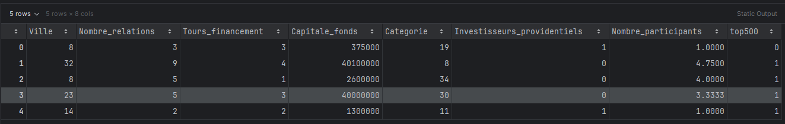

# Project-Advisor

This is our PFA (Projet de Fin d'Année) for our 5th year of computer studies.

## Project Description

The **Project-Advisor** is designed to assist project supervisors in efficiently managing projects. It provides tools for:

1. **User Management:** Advisors can create accounts and manage their projects.
2. **Project Proposal Submission:** Project owners can propose and submit ideas for their startup projects and the system will predict if the project has potentiel or no.

## Feasibility Study

The feasibility study offered by our system allows entrepreneurs to evaluate their projects based on two criteria:

1. **Profitability:** Determine if the project is profitable by estimating its potential profit.
2. **Potential for Success:** Assess if the project has the potential to gain a reputation among the TOP 500 projects in the same domain.

Additionally, the system provides an extensible feature for visitors and registered entrepreneurs to evaluate their entrepreneurial profiles through a questionnaire.

## Features

1. **User Management:**
   - Entrepreneurs can create accounts and manage their profiles.

2. **Project Management:**
   - Create a project, calculate its profit rank, and assess whether it has the potential to be among the TOP 500.

3. **Visitor Features:**
   - Visitors can evaluate if they possess an entrepreneurial profile.

## Technology Stack

- **Frontend:** HTML, CSS, JavaScript
- **Backend:** Spring Boot
- **Database:** PostgreSQL
- **Machine Learning** Sklearn (Kneignbors and RandomForestClassifier)
- **Version Control:** GitHub

## Installation and Setup

1. Clone the repository:
   ```bash
   git clone https://github.com/asmaembr/Project-advisor.git
   ```
2. Navigate to the project directory:
   ```bash
   cd Project-advisor
   ```
## Developed By:
- **Asmae Moubarriz**
- **Achraf Akrache**


## DataFlow Diagram


## Data Index

### TOP 500

### TOP 500 Accuracy


### Profile Analysis

### Profile Accuracy


### Profit Estimation

### Profit Accuracy


## Acknowledgements

We would like to thank our advisor and professor **Salma Chrit** for her continuous support and guidance throughout this project.