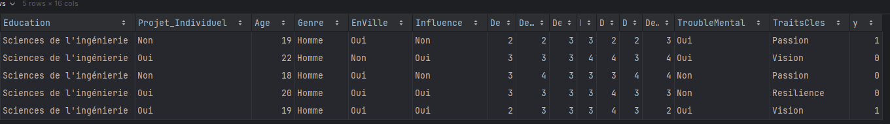

# Project-Advisor

This is our PFA (Projet de Fin d'Année) for our 5th year of computer studies.

## Project Description

The **Project-Advisor** is designed to assist project supervisors in efficiently managing It provides tools for:
**User Management:** advisors can create accounts and manage their profiles.
**Project Proposal Submission:** Project owners can propose and submit ideas for their startup project and claculate the doability of their project .

## Etude de faisabilité

l'étude de faisabilité d'un projet ou un startup offerte par notre systéme permet à l'entrepreneur  de tester cette faisabilité selon deux critére :
1- est ce que le projet est rentable ( valeur du profit est élevé en donnant une estimation )
2- est ce que le projet à un potentiel d'être réussi de gagner une réputation parmi les TOP 500 dans le même domaine .

le systéme aussi offre une fonctionnalité extensible pour les visiteurs et les entrepreneurs inscrits de tester leur profil entrepreneur à travers un questionnaire.

## Features

1. **User Management:**
   - entrepreneurs can create accounts and manage their profiles.

2. **Project Management:**
   - create a projet  , calculate the profit , check if the project can be a TOP 500 or no .

3. **Visitors Features:**
   - they can check if they are entrepreneur profils

## Technology Stack

- **Frontend:** HTML, CSS, JavaScript
- **Backend:** Spring Boot
- **Database:** PostgreSQL
- **Version Control:** GitHub

## Installation and Setup

1. Clone the repository:
   ```bash
   git clone https://github.com/asmaembr/Project-advisor.git
   ```
2. Navigate to the project directory:
   ```bash
   cd Project-advisor
   ```
## Made By : 
` Asmae Moubarriz ` and ` Achraf Akrache `
## Indice des données
**TOP500**


**PROFILE**


**PROFIT**


## Acknowledgements
We would like to thank our advisor and professor ` Salma Chrit ` for their continuous support and guidance throughout this project.
